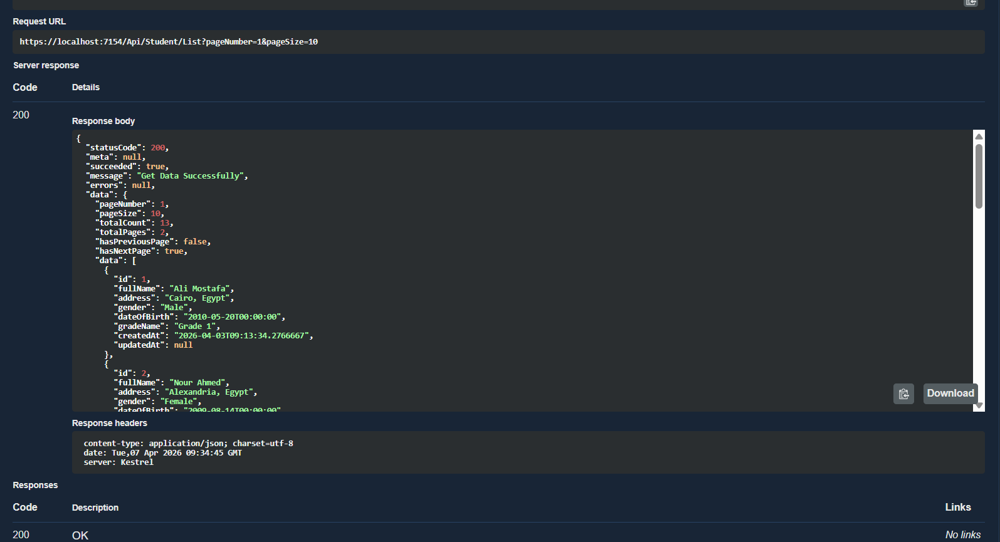
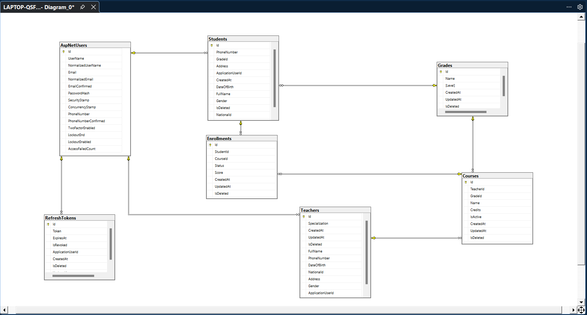
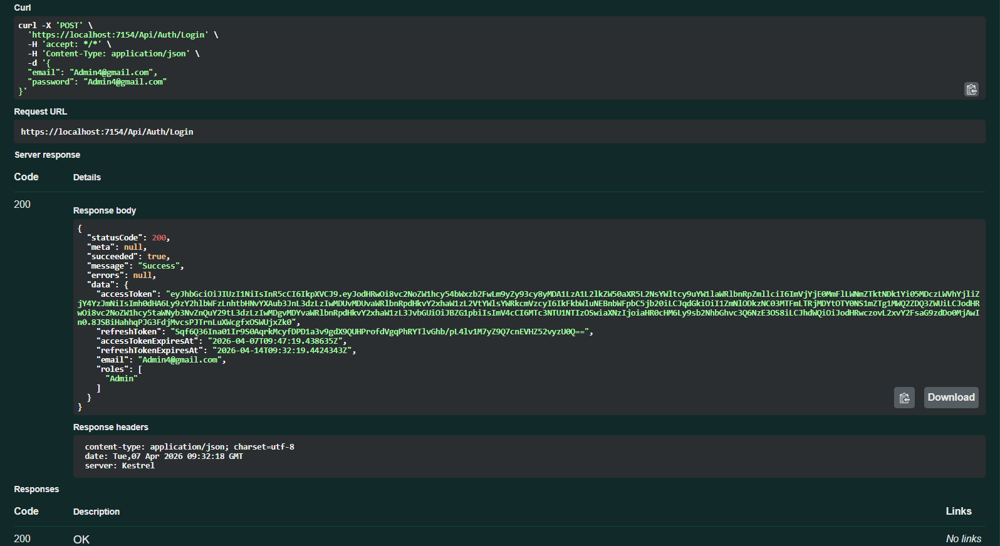

# 🏫 School-Management-System-Api

<div align="center">


**School Management System is a modern, full-featured REST API designed to streamline school operations and simplify the management of students, teachers, courses, grades, and enrollments. Built with Clean Architecture principles, this system provides a scalable and maintainable solution with role-based access control and JWT authentication.**

</div>

---

## 📋 Table of Contents

- [✨ Key Features](#-key-features)
- [🔑 Quick Start & Test Accounts](#-quick-start--test-accounts)
- [📡 API Endpoints](#-api-endpoints)
- [🛡️ Roles & Permissions](#️-roles--permissions)
- [🏗️ Architecture](#️-architecture)
- [🗄️ Database Schema](#️-database-schema)
- [🔐 Authentication & Authorization](#-authentication--authorization)
- [💻 Installation](#-installation)
- [⚙️ Configuration](#️-configuration)
- [🤝 Contributing](#-contributing)
- [👨‍💻 Author](#-author)

---

## ✨ Key Features

### 🔐 Authentication & Authorization

**Advanced Security Features:**
- **JWT-based authentication** with Access & Refresh Tokens
- **Secure password hashing** using ASP.NET Core Identity
- **Role-based authorization** (Admin, Teacher, Student)
- **Refresh token rotation** with automatic revocation
- **Token expiration handling** with configurable timeouts

**Key Components:**
- Access Token: Short-lived (configurable, default: 15 minutes)
- Refresh Token: Long-lived (default: 7 days) with database storage

---

### 👤 Student Management
Role-based access (Admin / Teacher / Student)

**Admin:**
- Create and update student profiles
- Search students by ID or filter by grade
- Soft delete students
- View all students with pagination

**Student:**
- View and update their own profile
- View their own enrollments and grades

**Teacher:**
- View students enrolled in their courses
- Search students by ID

---

### 🧑‍🏫 Teacher Management
Role-based access (Admin / Teacher)

**Admin:**
- Create and update teacher profiles
- Manage teacher salary
- Soft delete teachers
- View all teachers with pagination

**Teacher:**
- View and update their own profile (limited fields)
- Cannot modify their own salary

---

### 📚 Course Management
Role-based access (Admin / Teacher / Student)

**Admin:**
- Create, update, and soft delete courses
- Assign courses to teachers and grades
- View all courses with pagination

**Teacher:**
- View courses assigned to them
- View students enrolled in their courses

**Student:**
- View available courses for their grade

---

### 📝 Enrollment Management
Role-based access (Admin / Student)

**Admin:**
- Enroll or remove students from courses
- View all enrollments with filtering by course or student
- Update enrollment status

**Student:**
- View their own enrollments

---

### 🎓 Grade Management
Role-based access (Admin / Teacher / Student)

**Admin:**
- Create and manage grade levels
- View all grades

**Teacher:**
- Assign scores to students in their courses

**Student:**
- View their own grades and scores

---

### 📊 Advanced Features

**Pagination & Filtering:**



- **Server-side pagination** for all list endpoints
- **Advanced filtering** by Student, Teacher, Course, Grade, and Enrollment
- **Sorting capabilities** for all data tables
- **Performance optimized** queries with EF Core

**Validation & Error Handling:**
- **FluentValidation** for request validation
- **Global exception handling** middleware
- **Consistent API responses** with status codes
- **Business rule enforcement** at the application layer

---

## 🔑 Quick Start & Test Accounts

After running `dotnet ef database update`, the seeder automatically creates the following accounts ready to use:

| Role    | Email                  | Password            |
|---------|------------------------|---------------------|
| Admin   | Admin4@gmail.com       | Admin4@gmail.com    |
| Teacher | Teacher1@gmail.com     | Teacher1@gmail.com  |
| Student | Student10@gmail.com    | Student10@gmail.com |

> **Tip:** Use the Admin account first to explore all available endpoints, then test role restrictions with Teacher and Student accounts.

**Login endpoint:**
```http
POST https://localhost:7179/Api/Auth/Login
Content-Type: application/json

{
  "email": "Admin4@school.com",
  "password": "Admin4@school.com"
}
```

Copy the returned `accessToken` and paste it in Swagger under **Authorize → Bearer {token}**.

---

## 📡 API Endpoints

### 🔐 Auth

| Method | Endpoint                    | Description          | Auth Required |
|--------|-----------------------------|----------------------|---------------|
| POST   | `/Api/Auth/Login`           | Login & get tokens   | ❌            |
| POST   | `/Api/Auth/RefreshToken`    | Refresh access token | ❌            |
| POST   | `/Api/Auth/RegisterStudent` | Register new student | ❌            |
| POST   | `/Api/Auth/RegisterTeacher` | Register new teacher | Admin         |

### 👤 Students

| Method | Endpoint                         | Description                  | Role          |
|--------|----------------------------------|------------------------------|---------------|
| GET    | `/Api/Student`                   | Get all students (paginated) | Admin         |
| GET    | `/Api/Student/{id}`              | Get student by ID            | Admin/Student |
| GET    | `/Api/Student/ByGrade/{gradeId}` | Get students by grade        | Admin/Teacher |
| POST   | `/Api/Student`                   | Add new student              | Admin         |
| PUT    | `/Api/Student/{id}`              | Update student               | Admin/Student |
| DELETE | `/Api/Student/{id}`              | Soft delete student          | Admin         |

### 🧑‍🏫 Teachers

| Method | Endpoint            | Description                  | Role          |
|--------|---------------------|------------------------------|---------------|
| GET    | `/Api/Teacher`      | Get all teachers (paginated) | Admin         |
| GET    | `/Api/Teacher/{id}` | Get teacher by ID            | Admin/Teacher |
| POST   | `/Api/Teacher`      | Add new teacher              | Admin         |
| PUT    | `/Api/Teacher/{id}` | Update teacher               | Admin/Teacher |
| DELETE | `/Api/Teacher/{id}` | Soft delete teacher          | Admin         |

### 📚 Courses

| Method | Endpoint                        | Description                 | Role          |
|--------|---------------------------------|-----------------------------|---------------|
| GET    | `/Api/Course`                   | Get all courses (paginated) | Admin         |
| GET    | `/Api/Course/{id}`              | Get course by ID            | Admin/Teacher |
| GET    | `/Api/Course/ByGrade/{gradeId}` | Get courses by grade        | All           |
| POST   | `/Api/Course`                   | Add new course              | Admin         |
| PUT    | `/Api/Course/{id}`              | Update course               | Admin         |
| DELETE | `/Api/Course/{id}`              | Soft delete course          | Admin         |

### 📝 Enrollments

| Method | Endpoint                              | Description                     | Role          |
|--------|---------------------------------------|---------------------------------|---------------|
| GET    | `/Api/Enrollment`                     | Get all enrollments (paginated) | Admin         |
| GET    | `/Api/Enrollment/{id}`                | Get enrollment by ID            | Admin/Student |
| GET    | `/Api/Enrollment/ByCourse/{courseId}` | Get enrollments by course       | Admin/Teacher |
| POST   | `/Api/Enrollment`                     | Enroll student in course        | Admin         |
| PUT    | `/Api/Enrollment/{id}`                | Update enrollment status        | Admin         |
| DELETE | `/Api/Enrollment/{id}`                | Remove enrollment               | Admin         |

### 🎓 Grades

| Method | Endpoint          | Description                | Role          |
|--------|-------------------|----------------------------|---------------|
| GET    | `/Api/Grade`      | Get all grades (paginated) | Admin/Teacher |
| GET    | `/Api/Grade/{id}` | Get grade by ID            | All           |
| POST   | `/Api/Grade`      | Add new grade level        | Admin         |
| PUT    | `/Api/Grade/{id}` | Update grade               | Admin/Teacher |
| DELETE | `/Api/Grade/{id}` | Delete grade               | Admin         |

---

## 🛡️ Roles & Permissions

| Feature         | Action                | Admin | Teacher | Student |
|-----------------|-----------------------|:-----:|:-------:|:-------:|
| **Students**    | View all              | ✅    | ✅      | ❌      |
|                 | View own profile      | ✅    | ❌      | ✅      |
|                 | Create                | ✅    | ❌      | ❌      |
|                 | Update any            | ✅    | ❌      | ❌      |
|                 | Update own profile    | ✅    | ❌      | ✅      |
|                 | Delete                | ✅    | ❌      | ❌      |
| **Teachers**    | View all              | ✅    | ❌      | ❌      |
|                 | View own profile      | ✅    | ✅      | ❌      |
|                 | Create                | ✅    | ❌      | ❌      |
|                 | Update (incl. salary) | ✅    | ❌      | ❌      |
|                 | Update own profile    | ✅    | ✅ *    | ❌      |
|                 | Delete                | ✅    | ❌      | ❌      |
| **Courses**     | View all              | ✅    | ✅      | ✅      |
|                 | Create / Update       | ✅    | ❌      | ❌      |
|                 | Delete                | ✅    | ❌      | ❌      |
| **Enrollments** | View all              | ✅    | ✅      | ❌      |
|                 | View own              | ✅    | ❌      | ✅      |
|                 | Create / Update       | ✅    | ❌      | ❌      |
|                 | Delete                | ✅    | ❌      | ❌      |
| **Grades**      | View all              | ✅    | ✅      | ✅      |
|                 | Create / Update       | ✅    | ✅      | ❌      |
|                 | Delete                | ✅    | ❌      | ❌      |

> `*` Teacher can update their own profile but **cannot** modify their salary — only Admin can.

---

## 🏗️ Architecture

The system follows **Clean Architecture** with clear separation of concerns:

```
SchoolSystem
├── Solution Items
│    ├── .gitignore
│    └── README.md
│
├── SchoolProject.Api
│    ├── Controllers
│    │   ├── StudentController.cs
│    │   ├── TeacherController.cs
│    │   ├── CourseController.cs
│    │   ├── GradeController.cs
│    │   ├── EnrollmentController.cs
│    │   └── AuthController.cs
│    ├── Middleware
│    │   └── GlobalExceptionHandler.cs
│    ├── Base
│    │   └── AppControllerBase.cs
│    ├── Logs
│    │   └──...
│    ├── appsettings.json
│    └── Program.cs
│
├── SchoolProject.Application
│    ├── Interfaces
│    │   └── IAuthService.cs
│    ├── Bases
│    │   ├── PaginatedResponse.cs
│    │   ├── Response.cs
│    │   └── ResponseHandler.cs
│    ├── Features
│    │   ├── Auth
│    │   │   ├── Commands
│    │   │   │   ├── LoginCommand.cs
│    │   │   │   ├── RefreshTokenCommand.cs
│    │   │   │   ├── RegisterStudentCommand.cs
│    │   │   │   └── RegisterTeacherCommand.cs
│    │   │   ├── Handlers
│    │   │   │   └── AuthCommandHandler.cs
│    │   │   ├── Responses
│    │   │   │   ├── AuthResponse.cs
│    │   │   │   └── RegisterResponse.cs
│    │   │   └── Validators
│    │   │       ├── LoginValidator.cs
│    │   │       ├── RefreshTokenValidator.cs
│    │   │       ├── RegisterStudentValidator.cs
│    │   │       └── RegisterTeacherValidator.cs
│    │   ├── Enrollments
│    │   │    ├── Commands
│    │   │    │    ├── Handlers
│    │   │    │    │    └── EnrollmentCommandHandler.cs
│    │   │    │    ├── Models
│    │   │    │    │    ├── AddEnrollmentCommand.cs
│    │   │    │    │    ├── DeleteEnrollmentCommand.cs
│    │   │    │    │    └── UpdateEnrollmentCommand.cs
│    │   │    │    └── Validators
│    │   │    │         ├── AddEnrollmentValidator.cs
│    │   │    │         └── UpdateEnrollmentValidator.cs
│    │   │    └── Queries
│    │   │         ├── Handlers
│    │   │         │    └── EnrollmentQueryHandler.cs
│    │   │         ├── Models
│    │   │         │    ├── GetEnrollmentByIdQuery.cs
│    │   │         │    ├── GetEnrollmentListQuery.cs
│    │   │         │    └── GetEnrollmentsByCourseIdQuery.cs
│    │   │         └── Response
│    │   │              ├── GetEnrollmentByIdResponse.cs
│    │   │              ├── GetEnrollmentListResponse.cs
│    │   │              └── GetEnrollmentsByCourseIdResponse.cs
│    │   ├── Grades
│    │   │    ├── Commands
│    │   │    │    ├── Handlers
│    │   │    │    │    └── GradeCommandHandler.cs
│    │   │    │    ├── Models
│    │   │    │    │    ├── AddGradeCommand.cs
│    │   │    │    │    ├── DeleteGradeCommand.cs
│    │   │    │    │    └── UpdateGradeCommand.cs
│    │   │    │    └── Validators
│    │   │    │         ├── AddGradeValidator.cs
│    │   │    │         └── UpdateGradeValidator.cs
│    │   │    └── Queries
│    │   │         ├── Handlers
│    │   │         │    └── GradeQueryHandler.cs
│    │   │         ├── Models
│    │   │         │    ├── GetGradeByIdQuery.cs
│    │   │         │    └── GetGradeListQuery.cs
│    │   │         └── Response
│    │   │              ├── GetGradeByIdResponse.cs
│    │   │              └── GetGradeListResponse.cs
│    │   ├── Students
│    │   │    ├── Commands
│    │   │    │    ├── Handlers
│    │   │    │    │    └── StudentCommandHandler.cs
│    │   │    │    ├── Models
│    │   │    │    │    ├── AddStudentCommand.cs
│    │   │    │    │    ├── DeleteStudentCommand.cs
│    │   │    │    │    └── UpdateStudentCommand.cs
│    │   │    │    └── Validators
│    │   │    │         ├── AddStudentValidator.cs
│    │   │    │         └── UpdateStudentValidator.cs
│    │   │    └── Queries
│    │   │         ├── Handlers
│    │   │         │    └── StudentQueryHandler.cs
│    │   │         ├── Models
│    │   │         │    ├── GetStudentByIdQuery.cs
│    │   │         │    ├── GetStudentListQuery.cs
│    │   │         │    └── GetStudentsByGradeQuery.cs
│    │   │         └── Response
│    │   │              ├── GetStudentByIdResponse.cs
│    │   │              └── GetStudentListResponse.cs
│    │   └── Teachers
│    │        ├── Commands
│    │        │    ├── Handlers
│    │        │    │    └── TeacherCommandHandler.cs
│    │        │    ├── Models
│    │        │    │    ├── AddTeacherCommand.cs
│    │        │    │    ├── DeleteTeacherCommand.cs
│    │        │    │    └── UpdateTeacherCommand.cs
│    │        │    └── Validators
│    │        │         ├── AddTeacherValidator.cs
│    │        │         └── UpdateTeacherValidator.cs
│    │        └── Queries
│    │             ├── Handlers
│    │             │    └── TeacherQueryHandler.cs
│    │             ├── Models
│    │             │    ├── GetTeacherByIdQuery.cs
│    │             │    └── GetTeacherListQuery.cs
│    │             └── Response
│    │                  ├── GetTeacherByIdResponse.cs
│    │                  └── GetTeacherListResponse.cs
│    ├── Helpers
│    │   └── PaginationExtension.cs
│    ├── Mapping
│    │   ├── Courses
│    │   │   ├── CommandMapping
│    │   │   │   ├── AddCourseCommandMapping.cs
│    │   │   │   └── UpdateCourseCommandMapping.cs
│    │   │   └── QueryMapping
│    │   │       ├── GetCourseByIdMapping.cs
│    │   │       ├── GetCourseListMapping.cs
│    │   │       └── GetCoursesByGradeIdMapping.cs
│    │   ├── Enrollments
│    │   │   ├── CommandMapping
│    │   │   │   ├── AddEnrollmentCommandMapping.cs
│    │   │   │   └── UpdateEnrollmentCommandMapping.cs
│    │   │   └── QueryMapping
│    │   │       ├── GetEnrollmentByIdMapping.cs
│    │   │       ├── GetEnrollmentListMapping.cs
│    │   │       └── GetEnrollmentsByCourseIdMapping.cs
│    │   ├── Grades
│    │   │   ├── CommandMapping
│    │   │   │   ├── AddGradeCommandMapping.cs
│    │   │   │   └── UpdateGradeCommandMapping.cs
│    │   │   └── QueryMapping
│    │   │       ├── GetGradeByIdMapping.cs
│    │   │       └── GetGradeListMapping.cs
│    │   ├── Students
│    │   │   ├── CommandMapping
│    │   │   │   ├── AddStudentCommandMapping.cs
│    │   │   │   └── UpdateStudentCommandMapping.cs
│    │   │   └── QueryMapping
│    │   │       ├── GetStudentByIdMapping.cs
│    │   │       └── GetStudentListMapping.cs
│    │   └── Teachers
│    │       ├── CommandMapping
│    │       │   ├── AddTeacherCommandMapping.cs
│    │       │   └── UpdateTeacherCommandMapping.cs
│    │       └── QueryMapping
│    │           ├── GetTeacherByIdMapping.cs
│    │           └── GetTeacherListMapping.cs
│    └── ModuleApplicationDependencies.cs
│
├── SchoolProject.Domain
│    ├── Entities
│    │   ├── Student.cs
│    │   ├── Teacher.cs
│    │   ├── BaseEntity.cs
│    │   ├── Course.cs
│    │   ├── Enrollment.cs
│    │   ├── Grade.cs
│    │   ├── Person.cs
│    │   └── RefreshToken.cs
│    ├── Enums
│    │   ├── EnrollmentStatus.cs
│    │   └── Gender.cs
│    ├── Interfaces
│    │   ├── IStudentRepository.cs
│    │   ├── ITeacherRepository.cs
│    │   ├── ICourseRepository.cs
│    │   ├── IEnrollmentRepository.cs
│    │   ├── IGradeRepository.cs
│    │   ├── IRefreshTokenRepository.cs
│    │   └── IGenericRepositoryAsync.cs
│    ├── Helpers
│    │   └── JwtSettings.cs
│    └── AppMetaData
│        └── Router.cs
│
└── SchoolProject.Infrastructure
    ├── Data
    │   └── Seeders
    │        └── IdentitySeeder.cs
    ├── Configurations
    │   ├── StudentConfigurations.cs
    │   ├── TeacherConfigurations.cs
    │   ├── CourseConfigurations.cs
    │   ├── EnrollmentConfigurations.cs
    │   ├── RefreshTokenConfiguration.cs
    │   └── GradeConfigurations.cs
    ├── Identity
    │   └── ApplicationUser.cs
    ├── Context
    │   └── ApplicationDbContext.cs
    ├── Migrations/
    ├── Repositories
    │   ├── StudentRepository.cs
    │   ├── TeacherRepository.cs
    │   ├── CourseRepository.cs
    │   ├── EnrollmentRepository.cs
    │   ├── GradeRepository.cs
    │   ├── RefreshTokenRepository.cs
    │   └── GenericRepositoryAsync.cs
    ├── Services
    │   └── AuthService.cs
    └── ModuleInfrastructureDependencies.cs
```

### 🎨 Design Patterns Used

1. **Clean Architecture**: Four independent layers — `Api`, `Application`, `Domain`, `Infrastructure`
2. **CQRS Pattern**: Commands and Queries fully separated under each feature (e.g. `Features/Teachers/Commands` & `Features/Teachers/Queries`)
3. **Repository Pattern**: Data access abstracted via `Domain/Interfaces` and implemented in `Infrastructure/Repositories`
4. **Mediator Pattern**: MediatR handlers isolated per feature (`Commands/Handlers`, `Queries/Handlers`)
5. **Dependency Injection**: Services and repositories registered and injected across all layers
6. **AutoMapper**: Dedicated mapping profiles per feature (`Mapping/Teachers/CommandMapping`, `QueryMapping`, ...)
7. **FluentValidation**: Validators scoped per command (`Commands/Validators`)
8. **Seeder Pattern**: Initial data seeded via `Infrastructure/Data/Seeders`
9. **Middleware Pattern**: Custom middleware in `Api/Middleware` (e.g. global exception handling)
10. **Options Pattern**: App metadata and config centralized in `Domain/AppMetaData`

---

## 🗄️ Database Schema



### Relationships Summary

```
ApplicationUser 1:1 Student
ApplicationUser 1:1 Teacher
ApplicationUser 1:N RefreshToken

Grade 1:N Student
Student 1:N Enrollment
Course 1:N Enrollment
Teacher 1:N Course
Grade 1:N Course
```

### Database Features

- **Soft Delete Pattern**: All entities support soft delete (`IsDeleted` flag)
- **Indexes**: Strategic indexes on frequently queried columns
- **Foreign Keys**: Referential integrity with appropriate cascade rules
- **Timestamps**: Automatic `CreatedAt`/`UpdatedAt` tracking
- **Global Query Filters**: Automatic filtering of soft-deleted records
- **Lazy Loading**: Virtual navigation properties with proxies
- **Fluent Configuration**: Separate entity configurations per entity

---

## 🔐 Authentication & Authorization

### Login Flow



**Step-by-Step Process:**

1. User sends credentials (email/username + password) to `/Api/Auth/Login`
2. System validates credentials against database using ASP.NET Identity
3. If valid, generates JWT Access Token + Refresh Token
4. Refresh Token saved to database with expiration date
5. Returns tokens, user info, and roles in response
6. Client stores tokens and includes Access Token in `Authorization` header for subsequent requests

### Refresh Token Flow

When Access Token expires:

1. Client sends expired Access Token + Refresh Token to `/Api/Auth/RefreshToken`
2. System validates Refresh Token from database
3. If valid and not revoked, generates new Access Token + new Refresh Token
4. Old Refresh Token is revoked in database
5. New Refresh Token saved to database
6. Returns new tokens to client

**Token Security Features:**
- Short-lived Access Tokens (15 minutes)
- Refresh Token rotation (single-use tokens)
- Database storage for Refresh Tokens with revocation support
- Immediate revocation on logout
- Configurable expiration times

---

## 💻 Installation

### Prerequisites

- **.NET SDK 10.0** or higher ([Download](https://dotnet.microsoft.com/download))
- **SQL Server** 2019 or higher ([Download](https://www.microsoft.com/sql-server/sql-server-downloads))
- **Visual Studio 2022** or **VS Code** ([Download](https://visualstudio.microsoft.com/))
- **SQL Server Management Studio (SSMS)** (optional)

### Step-by-Step Setup

#### 1. Clone the Repository
```bash
git clone https://github.com/aymanragab8/School-Management-System-Api.git
cd SchoolManagementProject
```

#### 2. Restore NuGet Packages
```bash
dotnet restore
```

#### 3. Update Database Connection String

Open `appsettings.json` in `SchoolProject.Api` and update:

```json
{
  "constr": "Server=YOUR_SERVER_NAME;Database=SchoolProjectDb;Integrated Security=SSPI;TrustServerCertificate=True;MultipleActiveResultSets=True"
}
```

Replace `YOUR_SERVER_NAME` with your SQL Server instance name (e.g., `localhost`).

#### 4. Apply Database Migrations

```bash
cd "SchoolProject.Api"
dotnet ef database update
```

This will create the database and seed initial data including the default accounts listed in the [Quick Start](#-quick-start--test-accounts) section.

#### 5. Run the Application

```bash
dotnet run
```

The API will start at:
- **HTTPS**: `https://localhost:7179`
- **HTTP**: `http://localhost:5129`

#### 6. Access Swagger Documentation

```
https://localhost:7179/swagger
```

---

## ⚙️ Configuration

### JWT Settings

Configure JWT authentication in `appsettings.json`:

```json
{
  "JWT": {
    "SecritKey": "your-super-secret-key-minimum-32-characters-long",
    "AudienceIP": "https://localhost:4200",
    "IssuerIP": "https://localhost:7179",
    "TokenExpirationInMinutes": 15,
    "RefreshTokenExpirationInDays": 7
  }
}
```

**Important Security Notes:**
- `SecretKey` must be at least 32 characters. Use a strong random key in production.
- `AudienceIP`: Your frontend application URL
- `IssuerIP`: Your backend API URL

---

## 🤝 Contributing

1. **Fork the Repository**
2. **Create a Feature Branch**
   ```bash
   git checkout -b feature/AmazingFeature
   ```
3. **Commit Your Changes**
   ```bash
   git commit -m 'Add some AmazingFeature'
   ```
4. **Push to the Branch**
   ```bash
   git push origin feature/AmazingFeature
   ```
5. **Open a Pull Request**

---

## 👨‍💻 Author

**Ayman Ragab**

- 💼 Backend Developer specializing in ASP.NET Core
- 📧 Email: aymanragab2298@gmail.com
- 🌐 GitHub: [@aymanragab8](https://github.com/aymanragab8)
- 💼 LinkedIn: [Ayman Ragab](https://www.linkedin.com/in/ayman-ragab8/)

---

<div align="center">

### ⭐ Star this repository if you find it helpful!

[Back to Top ↑](#-school-management-system-api)

</div>
